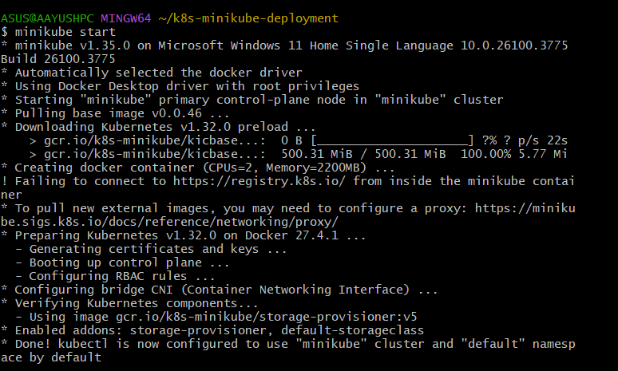
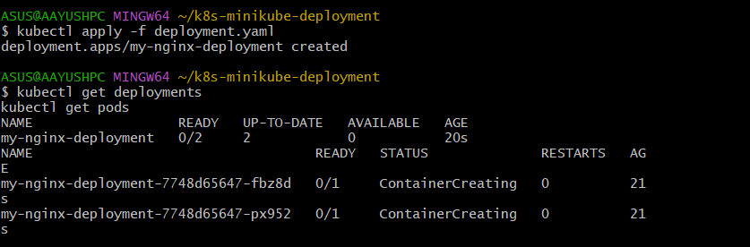
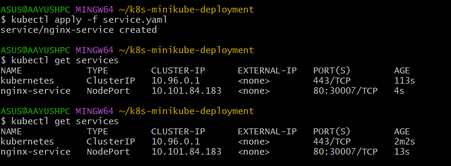
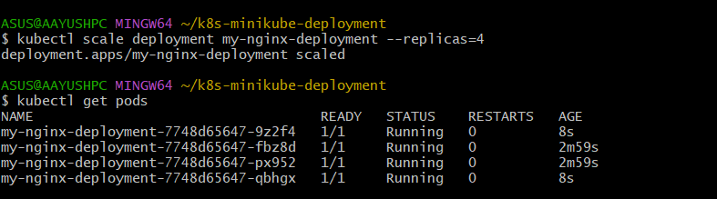
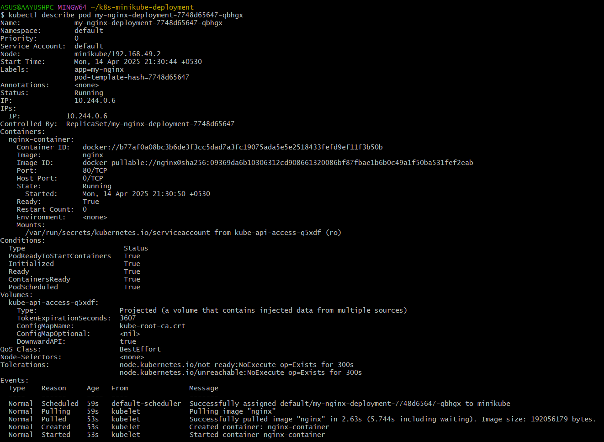
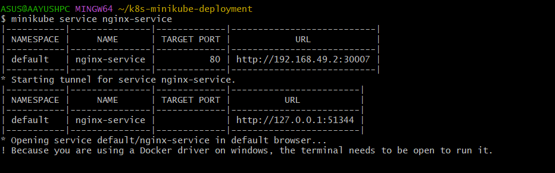
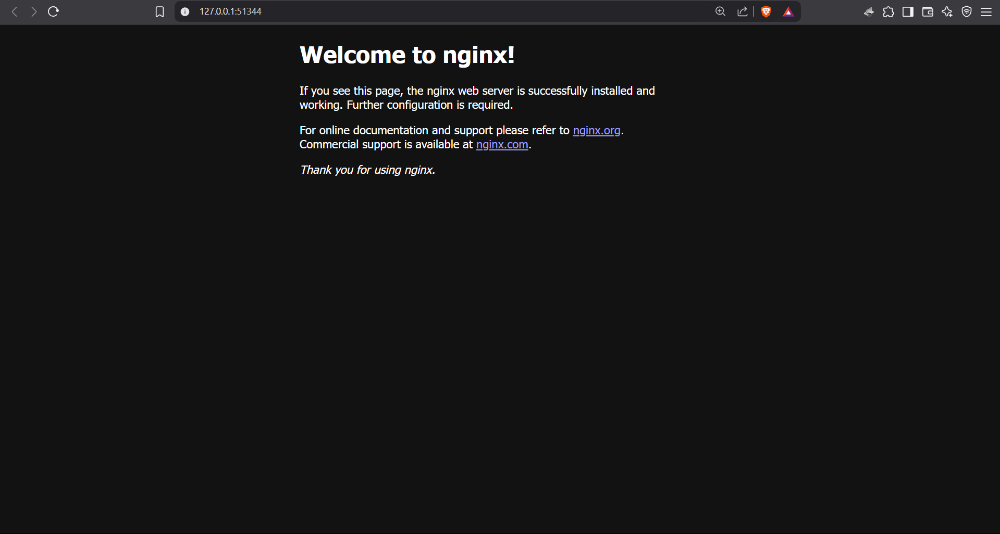

# 🚀 Kubernetes Deployment with Minikube

Here there 👋, Today we built a local Kubernetes cluster using **Minikube**, deploy an NGINX app, and have way too much fun scaling it like a cloud ninja ☁️⚔️

---

## 🧠 Objective

- Set up a **Minikube** cluster locally
- Deploy a containerized app using Kubernetes
- Expose it with a service
- Scale it like a boss 💪
- Check pods and logs like a detective 🔍

---

## 🛠️ Tools Used

- 🐳 Docker (as Minikube driver)
- ☸️ Minikube
- 🧙 kubectl
- 💻 Windows 11

---

## 📁 Folder Structure

k8s-minikube-deployment/ 
<br>├── deployment.yaml # NGINX Deployment 
<br>├── service.yaml # NodePort Service 
<br>├── screenshots/ # All steps visualized 
<br>└── README.md # You're here!


---

## 🪜 Step-by-Step Setup

### 🚦 1. Start Your Engines (Minikube)
```
minikube start --driver=docker
```
📸 Screenshot:


📦 2. Deploy the NGINX App
```
kubectl apply -f deployment.yaml
```
📸 Screenshot:


🌐 3. Expose the App
```
kubectl apply -f service.yaml
```
📸 Screenshot:


📈 4. Scale Like a Pro
```
kubectl scale deployment my-nginx-deployment --replicas=4
```
📸 Screenshot:


🧐 5. Peek Into a Pod
```
kubectl describe pod <pod-name>
```
📸 Screenshot:


🌍 6. Open the App in Your Browser
```
minikube service nginx-service
```
📸 Screenshot: Console Output


📸 Screenshot: Local Browser


💡 It should open the classic NGINX welcome page. Hello from the cluster! 👋

🧾 Bonus: Useful Commands
```
minikube start                   # Start the cluster
kubectl apply -f <file>.yaml     # Apply YAML
kubectl get pods/services        # Check status
kubectl scale deployment [...]   # Scale like a boss
kubectl describe pod <name>      # Inspect pods
minikube service <svc-name>      # Launch in browser
```

📬 About Me
Aayush Kukade
🌐 LinkedIn -- https://www.linkedin.com/in/aayushkukade/
🐙 GitHub -- https://github.com/its-tsukii/
🔉 Medium -- https://medium.com/@sroy10012001 #Find the whole story on medium along with my other endeavors 

Thanks for scrolling to the bottom. You get a cookie 🍪
